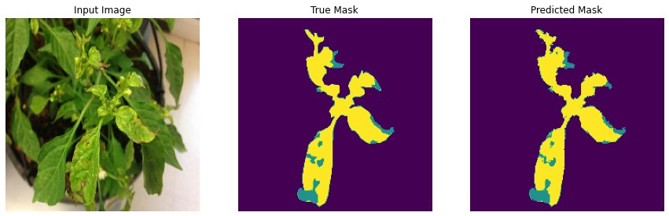

## segmentation sémantique des images

Ce projet consiste en une implémentation en TensorFlow d'un réseau FCN-8 (full convolutional) pour la segmentation sémantique. L'objectif principal de ce projet est de développer un réseau de neurones capable de segmenter des images de feuilles de plantes malades.

## 1. Dépendances
Ce projet nécessite les packages suivants pour fonctionner :
 - [Python 3](https://www.python.org/)
 - [TensorFlow](https://www.tensorflow.org/)
 - [NumPy](http://www.numpy.org/)
 - [cv2](https://opencv.org/)
 - [matplotlib](https://github.com/matplotlib/matplotlib/)

## 2.Fichiers
Les fichiers suivants font partie de ce projet :
* FCN_for_Semantic_Segmentation.ipynb : Fichier principal;
* Projet_INFO702_2022 : Bases de données 

## 2.Dataset
La base de données Projet_INFO702_2022 répertorié en deux dossiers : le dossier 'original_image' qui contient les images pour entrainer et tester le modèle de segmentation (répertoriées en train (451 images) /test (52 images)) et le dossier mask images qui contient les masques de segmentation pour chacune des images originales. Ces masques servent de vérité terrain lors de l'entrainement du modèle CNN. Il existe au total 3 catégories sémantiques, qui incluent des éléments comme le fond, la ou les feuilles et la ou les zones malades.
lien de téléchargement de la base de données : [Projet_INFO702_2022](https://drive.google.com/drive/folders/1yUMUm-QzhKKPOlGEyGVR7KnVEwP5erLf?usp=share_link)


## 3.Comment utiliser ce projet

Pour utiliser ce projet, il faur charger le fichier **FCN_for_Semantic_Segmentation.ipynb**, télécharger la base de données [Projet_INFO702_2022](https://drive.google.com/drive/folders/1yUMUm-QzhKKPOlGEyGVR7KnVEwP5erLf?usp=share_link) tout en l'ajoutant à son drive et ensuite éxecuter les différentes cellules du fichier. 

1. Cette cellule permet de charger les différentes librairies dont a besoin le projet.
``` py
import cv2
import numpy as np
from glob import glob
import matplotlib.pyplot as plt
%matplotlib inline
import os
import tensorflow as tf
from tensorflow.keras.layers import *
import datetime
import IPython.display as display
from IPython.display import clear_output
from google.colab import files
import math
import time
import warnings
warnings.filterwarnings('ignore')
AUTOTUNE = tf.data.experimental.AUTOTUNE
```

2. Cette cellule permet de spécifier le chemin de chaque repertoire du train et du test ainsi que leurs masques de segmentation de la base de données.
``` py
# Dataset path
dataset_path = '/content/drive/MyDrive/Projet_INFO702_2022-20230105T144036Z-001/Projet_INFO702_2022/'

img_train = dataset_path + 'original_images/train/'
seg_train = dataset_path + 'mask_images/train/'

img_val = dataset_path + 'original_images/test/'
seg_val = dataset_path + 'mask_images/test/'
```

3. Cette cellule permet de pouvoir définir une taille, le nombre de channel et le nombre de classe de nos images.
``` py
(HEIGHT,WIDTH) = (224,224)
N_CHANNELS = 3
N_CLASSES = 76
```

4. Cette cellule est une fonction qui nous retourne pour une image donné son masque de segmantation.
``` py
def parse_image(img_path):
    """
    Load an image and its annotation (mask) and returning a dictionary.
    """
    # Reading the image
    image = tf.io.read_file(img_path)
    image = tf.image.decode_jpeg(image,channels=3)
    # For one Image path:
    # .../original_images/train/Apple_Rust/train_Apple_Rust_17.jpg
    # Its corresponding annotation path is:
    # .../mask_images/train/Apple_Rust/train_Apple_Rust_17_label.png
    mask_path = tf.strings.regex_replace(img_path, "original_images", "mask_images")
    mask_path = tf.strings.regex_replace(mask_path, ".jpg","_label.png")
    # Reading the annotation file corresponding the image file
    mask = tf.io.read_file(mask_path)
    mask = tf.image.decode_png(mask,channels=1)
    return {'image': image, 'segmentation_mask': mask}
```

5. Cette cellule nous permet d'appliquer la fonction **parse_image** sur l'ensemnle de nos images (le  train et le test) et nous retourne un **train_dataset** (contenant pour chaque image d'entrainement son masque) et un **val_dataset** (contenant pour chaque image de test son masque).
``` py
train_dataset = tf.data.Dataset.list_files(img_train+'*/*.jpg', seed=SEED)
train_dataset = train_dataset.map(parse_image)

val_dataset = tf.data.Dataset.list_files(img_val+'*/*.jpg', seed=SEED)
val_dataset =val_dataset.map(parse_image)
```

6. Cette cellule est une fonction qui nous permet de normaliser nos images (valeurs comprise entre 0 et 1).
``` py
def normalize(input_image, input_mask):
    input_image = tf.cast(input_image, tf.float32) / 255.0
    return input_image, input_mask
```

7. Cette cellule contient les fonctions **load_image_train** et **load_image_test** qui permet de d'appliquer la fonction **parse_image** (normaliser nos pixels) et redimensionner nos images.
``` py
def load_image_train(datapoint):
    """
    Normalize and resize a train image and its annotation.
    Apply random transformations to an input dictionary containing a train image and its annotation.
    """
    input_image = tf.image.resize(datapoint['image'], (HEIGHT,WIDTH))
    input_mask = tf.image.resize(datapoint['segmentation_mask'], (HEIGHT,WIDTH))
    input_image, input_mask = normalize(input_image, input_mask)
    return input_image, input_mask

def load_image_test(datapoint):
    """
    Normalize and resize a test image and its annotation.
    Since this is for the test set, we don't need to apply any data augmentation technique.
    """
    input_image = tf.image.resize(datapoint['image'], (HEIGHT,WIDTH))
    input_mask = tf.image.resize(datapoint['segmentation_mask'], (HEIGHT,WIDTH))
    input_image, input_mask = normalize(input_image, input_mask)
    return input_image, input_mask
```

9. Cette cellule nous permet de définir une valeur de notre BATCH_SIZE, BUFFER_SIZE et un dictionnaire **dataset** contenant notre train_dataset et notre val_dataset.
``` py
BATCH_SIZE = 16
BUFFER_SIZE = 1500
dataset = {"train": train_dataset, "val": val_dataset}
```

10. Cette cellule nous permet d'appliquer la fonction **load_image_train** sur la Dataset **train_dataset** et  la fonction **load_image_test** sur la Dataset **val_dataset**.
``` py
dataset['train'] = dataset['train'].map(load_image_train, num_parallel_calls=tf.data.experimental.AUTOTUNE)
dataset['train'] = dataset['train'].shuffle(buffer_size=BUFFER_SIZE, seed=SEED)
dataset['train'] = dataset['train'].repeat()
dataset['train'] = dataset['train'].batch(BATCH_SIZE)
dataset['train'] = dataset['train'].prefetch(buffer_size=AUTOTUNE)
print(dataset['train'])
#
dataset['val'] = dataset['val'].map(load_image_test)
dataset['val'] = dataset['val'].repeat()
dataset['val'] = dataset['val'].batch(BATCH_SIZE)
dataset['val'] = dataset['val'].prefetch(buffer_size=AUTOTUNE)
print(dataset['val'])
```

11. importation du poids du modèle **VGG** et définiton du modèle **FCN8**.
``` py
from tensorflow.keras.models import *
from tensorflow.keras.layers import *

VGG_Weights_path = '/content/drive/MyDrive/vgg16_weights_tf_dim_ordering_tf_kernels_notop.h5'

IMAGE_ORDERING = 'channels_last'

def FCN8(nClasses ,  input_height=224, input_width=224):
    ## input_height and width must be devisible by 32 because maxpooling with filter size = (2,2) is operated 5 times,
    ## which makes the input_height and width 2^5 = 32 times smaller
    assert input_height%32 == 0
    assert input_width%32 == 0
    IMAGE_ORDERING =  "channels_last" 

    img_input = Input(shape=(input_height,input_width, 3)) ## Assume 224,224,3
    
    ## Block 1
    x = Conv2D(64, (3, 3), activation='relu', padding='same', name='block1_conv1', data_format=IMAGE_ORDERING )(img_input)
    x = Conv2D(64, (3, 3), activation='relu', padding='same', name='block1_conv2', data_format=IMAGE_ORDERING )(x)
    x = MaxPooling2D((2, 2), strides=(2, 2), name='block1_pool', data_format=IMAGE_ORDERING )(x)
    f1 = x
    
    # Block 2
    x = Conv2D(128, (3, 3), activation='relu', padding='same', name='block2_conv1', data_format=IMAGE_ORDERING )(x)
    x = Conv2D(128, (3, 3), activation='relu', padding='same', name='block2_conv2', data_format=IMAGE_ORDERING )(x)
    x = MaxPooling2D((2, 2), strides=(2, 2), name='block2_pool', data_format=IMAGE_ORDERING )(x)
    f2 = x

    # Block 3
    x = Conv2D(256, (3, 3), activation='relu', padding='same', name='block3_conv1', data_format=IMAGE_ORDERING )(x)
    x = Conv2D(256, (3, 3), activation='relu', padding='same', name='block3_conv2', data_format=IMAGE_ORDERING )(x)
    x = Conv2D(256, (3, 3), activation='relu', padding='same', name='block3_conv3', data_format=IMAGE_ORDERING )(x)
    x = MaxPooling2D((2, 2), strides=(2, 2), name='block3_pool', data_format=IMAGE_ORDERING )(x)
    pool3 = x

    # Block 4
    x = Conv2D(512, (3, 3), activation='relu', padding='same', name='block4_conv1', data_format=IMAGE_ORDERING )(x)
    x = Conv2D(512, (3, 3), activation='relu', padding='same', name='block4_conv2', data_format=IMAGE_ORDERING )(x)
    x = Conv2D(512, (3, 3), activation='relu', padding='same', name='block4_conv3', data_format=IMAGE_ORDERING )(x)
    pool4 = MaxPooling2D((2, 2), strides=(2, 2), name='block4_pool', data_format=IMAGE_ORDERING )(x)## (None, 14, 14, 512) 

    # Block 5
    x = Conv2D(512, (3, 3), activation='relu', padding='same', name='block5_conv1', data_format=IMAGE_ORDERING )(pool4)
    x = Conv2D(512, (3, 3), activation='relu', padding='same', name='block5_conv2', data_format=IMAGE_ORDERING )(x)
    x = Conv2D(512, (3, 3), activation='relu', padding='same', name='block5_conv3', data_format=IMAGE_ORDERING )(x)
    pool5 = MaxPooling2D((2, 2), strides=(2, 2), name='block5_pool', data_format=IMAGE_ORDERING )(x)## (None, 7, 7, 512)

    #x = Flatten(name='flatten')(x)
    #x = Dense(4096, activation='relu', name='fc1')(x)
    # <--> o = ( Conv2D( 4096 , ( 7 , 7 ) , activation='relu' , padding='same', data_format=IMAGE_ORDERING))(o)
    # assuming that the input_height = input_width = 224 as in VGG data
    
    #x = Dense(4096, activation='relu', name='fc2')(x)
    # <--> o = ( Conv2D( 4096 , ( 1 , 1 ) , activation='relu' , padding='same', data_format=IMAGE_ORDERING))(o)   
    # assuming that the input_height = input_width = 224 as in VGG data
    
    #x = Dense(1000 , activation='softmax', name='predictions')(x)
    # <--> o = ( Conv2D( nClasses ,  ( 1 , 1 ) ,kernel_initializer='he_normal' , data_format=IMAGE_ORDERING))(o)
    # assuming that the input_height = input_width = 224 as in VGG data
    
    
    vgg  = Model(  img_input , pool5  )
    vgg.load_weights(VGG_Weights_path) ## loading VGG weights for the encoder parts of FCN8
    
    n = 4096
    o = ( Conv2D( n , ( 7 , 7 ) , activation='relu' , padding='same', name="conv6", data_format=IMAGE_ORDERING))(pool5)
    conv7 = ( Conv2D( n , ( 1 , 1 ) , activation='relu' , padding='same', name="conv7", data_format=IMAGE_ORDERING))(o)
    
    
    ## 4 times upsamping for pool4 layer
    conv7_4 = Conv2DTranspose( nClasses , kernel_size=(4,4) ,  strides=(4,4) , use_bias=False, data_format=IMAGE_ORDERING )(conv7)
    ## (None, 224, 224, 10)
    ## 2 times upsampling for pool411
    pool411 = ( Conv2D( nClasses , ( 1 , 1 ) , activation='relu' , padding='same', name="pool4_11", data_format=IMAGE_ORDERING))(pool4)
    pool411_2 = (Conv2DTranspose( nClasses , kernel_size=(2,2) ,  strides=(2,2) , use_bias=False, data_format=IMAGE_ORDERING ))(pool411)
    
    pool311 = ( Conv2D( nClasses , ( 1 , 1 ) , activation='relu' , padding='same', name="pool3_11", data_format=IMAGE_ORDERING))(pool3)
        
    o = Add(name="add")([pool411_2, pool311, conv7_4 ])
    o = Conv2DTranspose( nClasses , kernel_size=(8,8) ,  strides=(8,8) , use_bias=False, data_format=IMAGE_ORDERING )(o)
    o = (Activation('softmax'))(o)
    
    model = Model(img_input, o)

    return model
```

12. appel de la fonction **FCN8**
``` py
model = FCN8(N_CLASSES,input_height=224, input_width=224)
```

13. Cette cellule permet de créer des objets loss_object, optimizer, ckpt, manager. 
``` py
loss_object = tf.keras.losses.SparseCategoricalCrossentropy()
optimizer = tf.keras.optimizers.Adam()
ckpt = tf.train.Checkpoint(step=tf.Variable(1), optimizer=optimizer, net=model)
manager = tf.train.CheckpointManager(ckpt, 'tf_ckpts/', max_to_keep=3)
```

14.  Cette cellule permet de créer des objets  pour calculer le **train_loss**, **train_accuracy**, **test_loss**, **test_accuracy**. 
``` py
train_loss = tf.keras.metrics.Mean('train_loss', dtype=tf.float32)
train_accuracy = tf.keras.metrics.SparseCategoricalAccuracy('train_accuracy')
test_loss = tf.keras.metrics.Mean('test_loss', dtype=tf.float32)
test_accuracy = tf.keras.metrics.SparseCategoricalAccuracy('test_accuracy')
```

15.  Cette cellule permet de rédéfinir les fonctions **train_step**, **train_and_checkpoint**, **test_step** de tensorflow.
``` py
@tf.function
def train_step(model, optimizer, x_train, y_train):
    with tf.GradientTape() as tape:
        predictions = model(x_train, training=True)
        loss = loss_object(y_train, predictions)
    grads = tape.gradient(loss, model.trainable_variables)
    optimizer.apply_gradients(zip(grads, model.trainable_variables))
    train_loss(loss)
    train_accuracy(y_train, predictions)
    
def train_and_checkpoint(model, manager, dataset, epoch):
    ckpt.restore(manager.latest_checkpoint)
    if manager.latest_checkpoint:
        print("Restored from {}".format(manager.latest_checkpoint))
    else:
        print("Initializing from scratch.")
    for (x_train, y_train) in dataset['train'].take(math.ceil(451/3)): 
        train_step(model, optimizer, x_train, y_train)
    ckpt.step.assign_add(1)
    save_path = manager.save()
    print("Saved checkpoint for epoch {}: {}".format(epoch, save_path))
    
@tf.function
def test_step(model, x_test, y_test):
    predictions = model(x_test)
    loss = loss_object(y_test, predictions)
    test_loss(loss)
    test_accuracy(y_test, predictions)
    return predictions
```

16.  Cette cellule permet de créer des objets  pour calculer le **train_loss**, **train_accuracy**, **test_loss**, **test_accuracy**. 
``` py
train_loss = tf.keras.metrics.Mean('train_loss', dtype=tf.float32)
train_accuracy = tf.keras.metrics.SparseCategoricalAccuracy('train_accuracy')
test_loss = tf.keras.metrics.Mean('test_loss', dtype=tf.float32)
test_accuracy = tf.keras.metrics.SparseCategoricalAccuracy('test_accuracy')
```

17. Cette cellule permet de lancer l'entrainement de notre modèle FCN8 et de sauvegarder nos epochs.
``` py
# This variable will help to save the best model if its performance increases after an epoch   
highest_accuracy = 0

for epoch in range(20):

    print("Epoch ",epoch+1)
    
    # Getting the current time before starting the training
    # This will help to keep track of how much time an epoch took
    start = time.time()
    
    train_and_checkpoint(model, manager, dataset, epoch+1)
    
    # Saving the train loss and train accuracy metric for TensorBoard visualization
    with train_summary_writer.as_default():
        tf.summary.scalar('loss', train_loss.result(), step=ckpt.step.numpy())
        tf.summary.scalar('accuracy', train_accuracy.result(), step=ckpt.step.numpy())
    
    # Validation phase
    for (x_test, y_test) in dataset['val'].take(math.ceil(52/3)):
        pred = test_step(model, x_test, y_test)
    
    # Saving the validation loss and validation accuracy metric for Tensorboard visualization
    with test_summary_writer.as_default():
        tf.summary.scalar('loss', test_loss.result(), step=ckpt.step.numpy())
        tf.summary.scalar('accuracy', test_accuracy.result(), step=ckpt.step.numpy())
    
    # Calculating the time it took for the entire epoch to run
    print("Time taken ",time.time()-start)
    
    # Printing the metrics for the epoch
    template = 'Epoch {}, Loss: {:.3f}, Accuracy: {:.3f}, Val Loss: {:.3f}, Val Accuracy: {:.3f}'
    print (template.format(epoch+1,
                            train_loss.result(), 
                            train_accuracy.result()*100,
                            test_loss.result(), 
                            test_accuracy.result()*100))
    
    # If accuracy has increased in this epoch, updating the highest accuracy and saving the model
    if(test_accuracy.result().numpy()*100>highest_accuracy):
        print("Validation accuracy increased from {:.3f} to {:.3f}. Saving model weights.".format(highest_accuracy,test_accuracy.result().numpy()*100))
        highest_accuracy = test_accuracy.result().numpy()*100
        model.save_weights('unet_weights-epoch-{}.hdf5'.format(epoch+1))

    print('_'*80)

    # Reset metrics after every epoch
    train_loss.reset_states()
    test_loss.reset_states()
    train_accuracy.reset_states()
    test_accuracy.reset_states()
```

17.  Cette cellule est une fonction qui permet à partir de notre modèle **FCN8** de prédire pour une image donné sa segmentation.
``` py
def predict(model,image_path):
    datapoint = parse_image(image_path)
    input_image,image_mask = load_image_test(datapoint)
    img = tf.expand_dims(input_image, 0)
    prediction = model(img)
    prediction = tf.argmax(prediction, axis=-1)
    prediction = tf.squeeze(prediction, axis = 0)
    pred_mask = tf.expand_dims(prediction, axis=-1)
    display_sample([input_image, image_mask, pred_mask])
    return image_mask, pred_mask
```


18.  Cette cellule est une fonction qui permet calculer la moyenne IoU.
``` py
def IoU(y_i,y_pred):
    IoUs = []
    n_classes = 3
    for c in range(n_classes):
        TP = np.sum((y_i == c)&(y_pred==c))
        FP = np.sum((y_i != c)&(y_pred==c))
        FN = np.sum((y_i == c)&(y_pred!= c))
        IoU = TP/float(TP + FP + FN)
        IoU={:4.3f}".format(c,TP,FP,FN,IoU))
        if(math.isnan(IoU)):
            IoUs.append(0)
            continue
        IoUs.append(IoU)
    mIoU = np.mean(IoUs)
    return mIoU
```

4.Résultat



